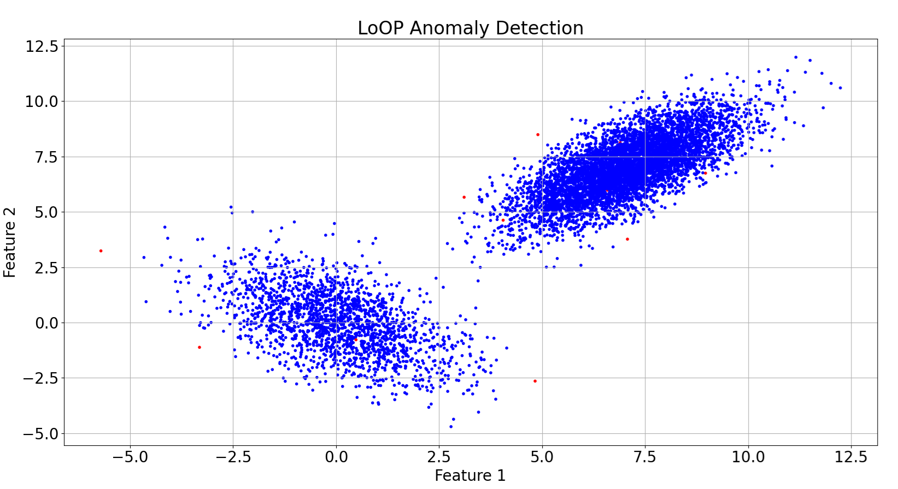

# Local Outlier Probability (LoOP) Algorithm

## Overview

This repository provides an implementation of the **Local Outlier Probability (LoOP)** algorithm in Python.
LoOP is a density-based anomaly detection algorithm that assigns each data point a probabilistic score indicating its likelihood of being an outlier.

Unlike traditional methods that only classify points as outliers or not, LoOP outputs continuous probability scores, 
making it easier to interpret and set threshold values for practical applications.

## Features

- **Unsupervised anomaly detection:** Does not require labeled training data.
- **Probabilistic interpretation:** Clearly understandable outlier scores (between 0 and 1).
- **Local density calculation:** Evaluates outliers based on local neighborhood densities.
- **Visualization:** Provides clear visualizations highlighting detected anomalies.




## Repository Structure

```
LoOP-Algorithm
├── README.md
├── loop_algorithm.py
└── data
    └── data.csv
```

- **loop_algorithm.py:** Python implementation of the LoOP algorithm.
- **data folder:** Contains datasets used for running and validating the algorithm.

## How to Run

### Prerequisites

- Python 3.x
- Pandas
- NumPy
- Matplotlib

You can install these dependencies using pip:

```bash
pip install numpy pandas matplotlib
```

### Running the Algorithm

Execute the Python script directly with your dataset:

```bash
python loop_algorithm.py
```

- Adjust `file_path`, `lmbda`, and `K` parameters within the `loop_algorithm.py` as needed:
  - `file_path`: Path to your CSV dataset.
  - `lmbda`: Typically ranges between 1 and 3, affecting sensitivity.
  - `K`: Number of nearest neighbors.

## Visualization

- Points classified with a high probability of being anomalies (LoOP score ≥ 0.9) are plotted in red.
- Normal data points are shown in blue.

## Use Cases

- **Fraud Detection**
- **Network Intrusion Detection**
- **Manufacturing Quality Control**
- **Anomaly Detection in Sensor Data**

## Reference

This project is based on the following paper:

Kriegel, H. P., Kröger, P., Schubert, E., & Zimek, A. (2009).  
LoOP: local outlier probabilities. In Proceedings of the 18th ACM conference on Information and knowledge management (CIKM '09), 1649-1652. ACM.  
https://doi.org/10.1145/1645953.1646195
